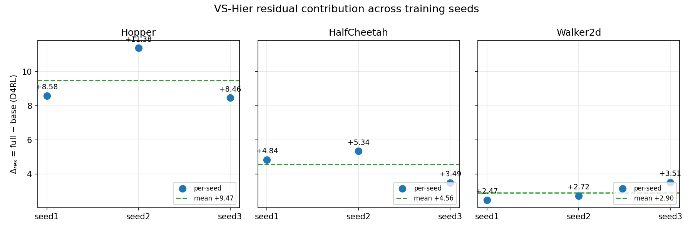
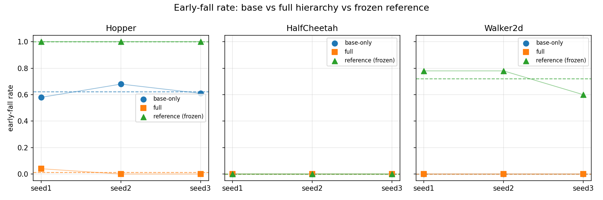

# Fresh Frozen-DDIM Cotrain 2.5M — 完整结果汇总

> 实验:VS-Hier(three-critic hierarchy, `fresh_frozen_ddim_2p5m_cotrain`)
> B=500k(base-only, QA_joint shadow) → R=2.0M(协同,β hold 50k + ramp 至 0.1,base_lane=0.5,
> cross_lane_ratio=0.25,residual_exploration_std=0.02)
> 单位:2.5M action-chunks = 10M primitive env steps,n_envs=10

## 评估协议(全部 run 同口径)

- 100 episodes / run / mode;env seeds 锁定 **10000–10099**;policy_seed_start=20000;stochastic;
  protocol_v=1(exact evaluator,`evaluate_exact_episodes`)
- 三种模式取自同一 checkpoint:
  - `current_base_only` = 关闭 residual(base 分支单独推理)
  - `current_full_hierarchy` = 完整 VS-Hier(主结果)
  - `reference_base` = 冻结 DDIM 预训练 policy(无 RL)
- 数据来源:`logs/p6/fresh_frozen_ddim_cotrain_<env>_seed<N>_2500000chunks/run_manifest.json`
  → `final_evaluation_mode_summaries`(9/9 run,全部 complete)

## Locomotion 主实验

| 实验 | Hopper | HalfCheetah | Walker2d | 备注 |
|---|---|---|---|---|
| Frozen DDIM reference | 49.52 | 39.34 | 54.67 | 冻结预训练 policy |
| 独立 DSRL reproduction,seed 1 | 95.17 | 42.59 | 82.91 | 非严格 matched(不同初始化) |
| VS-Hier base-only,seed 1 | 87.54 | 52.63 | 88.65 | 同一 checkpoint 关闭 residual |
| VS-Hier base-only,seed 2 | 84.22 | 49.48 | 88.98 | |
| VS-Hier base-only,seed 3 | 85.84 | 55.44 | 87.90 | |
| VS-Hier full,seed 1 | 96.12 | 57.47 | 91.12 | |
| VS-Hier full,seed 2 | 95.60 | 54.82 | 91.70 | |
| VS-Hier full,seed 3 | 94.30 | 58.93 | 91.41 | HC seed3 由重训器从 900k ckpt 恢复完成 |
| 严格 matched DSRL,seeds 1/2/3 | - | - | - | 未跑(configs 就绪:`p6_*_fresh_control_2p5m`) |
| Joint-credit baseline,seeds 1/2/3 | - | - | - | 未跑(需新代码,E4) |

### VS-Hier full 跨 seed 统计

| | Hopper | HalfCheetah | Walker2d |
|---|---|---|---|
| seed 1/2/3 | 96.12 / 95.60 / 94.30 | 57.47 / 54.82 / 58.93 | 91.12 / 91.70 / 91.41 |
| **mean ± std** | **95.34 ± 0.75** | **57.07 ± 1.69** | **91.41 ± 0.24** |

## Δresidual = full − base(核心结果:9/9 全部为正)

| | seed1 | seed2 | seed3 | mean |
|---|---|---|---|---|
| Hopper base | 87.54 | 84.22 | 85.84 | 85.87 ± 1.36 |
| Hopper full | 96.12 | 95.60 | 94.30 | 95.34 ± 0.75 |
| **Hopper Δres** | **+8.58** | **+11.38** | **+8.46** | **+9.47** |
| HC base | 52.63 | 49.48 | 55.44 | 52.52 ± 2.44 |
| HC full | 57.47 | 54.82 | 58.93 | 57.07 ± 1.69 |
| **HC Δres** | **+4.84** | **+5.34** | **+3.49** | **+4.56** |
| Walker base | 88.65 | 88.98 | 87.90 | 88.51 ± 0.45 |
| Walker full | 91.12 | 91.70 | 91.41 | 91.41 ± 0.24 |
| **Walker Δres** | **+2.47** | **+2.72** | **+3.50** | **+2.90** |

结论:residual 在三任务 × 三 seed 上一致为正贡献,Hopper 上最强(+9.47 均值)且伴随早衰消除。

## 早衰率(early-fall rate)

| | seed1 | seed2 | seed3 |
|---|---|---|---|
| Hopper base | 0.58 | 0.68 | 0.61 |
| **Hopper full** | **0.04** | **0.00** | **0.00** |
| Hopper reference | 1.00 | 1.00 | 1.00 |
| HC base / full / ref | 0 / 0 / 0 | 0 / 0 / 0 | 0 / 0 / 0 |
| Walker base | 0.00 | 0.00 | 0.00 |
| **Walker full** | **0.00** | **0.00** | **0.00** |
| Walker reference | 0.78 | 0.78 | 0.60 |

Hopper 是唯一的失败态任务:冻结 reference 全倒(100%),RL base 仍倒 58–68%,加 residual 后降至 ~0-4%。

## residual 使用量(健康 episode 的 action_residual_delta L2)

| | seed1 | seed2 | seed3 |
|---|---|---|---|
| Hopper | 0.377 | 0.350 | 0.374 |
| HC | 0.477 | 0.479 | 0.500 |
| Walker | 0.511 | 0.514 | 0.515 |

残差在所有任务上被实质使用(非退化为 0),Walker 使用量最高。

## 对比解释(任务间差异)

| | base−DSRL | Δres | full−DSRL |
|---|---|---|---|
| Hopper | −7.63 | +9.47 | +0.17 |
| HC | +9.93 | +4.56 | +14.49 |
| Walker | +5.60 | +2.90 | +8.50 |

- Hopper:DSRL 已很强,residual 主要救回 base 的跌倒(base 本身在 DSRL 之下)
- HC/Walker:cotrain base 就超过 DSRL,residual 再叠加正增益

## Run 出处与恢复记录

| run | 完成 | 备注 |
|---|---|---|
| 9 × cotrain(3 env × 3 seed) | 全部 complete | seed1:08-10~13;seed2:08-20;seed3:08-21 |
| HC seed3 | complete | 08-19 OOM 死于 947.5k(500k bundle),重训器从 900k model checkpoint 恢复,08-21 完成;结果 58.93 为三 seed 最高 |
| 其余 seed2/3 | complete | 08-19 晚 OOM 后由 watchdog + 重训器从 1M bundle 恢复 |

## 未完成项

- 严格 matched DSRL(fresh control)seeds 1/2/3 —— 配置就绪,占位 `-`
- Joint-credit baseline(E4)seeds 1/2/3 —— 需新代码(信用分配开关),占位 `-`
